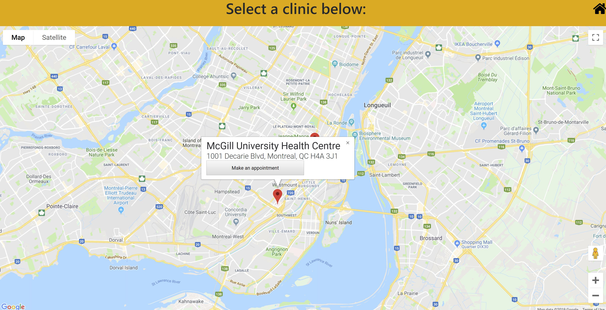
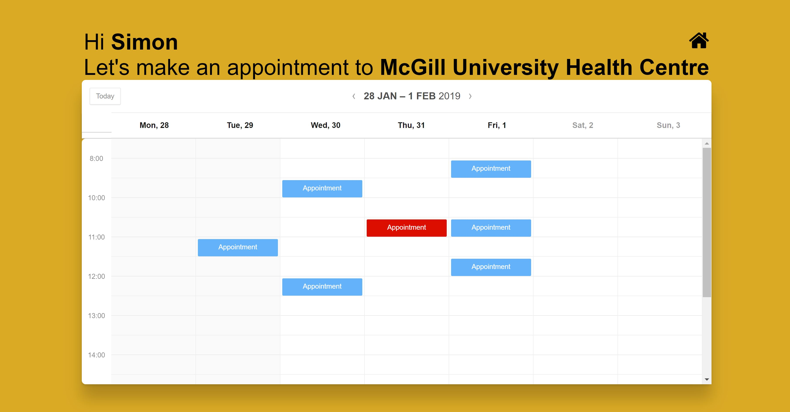
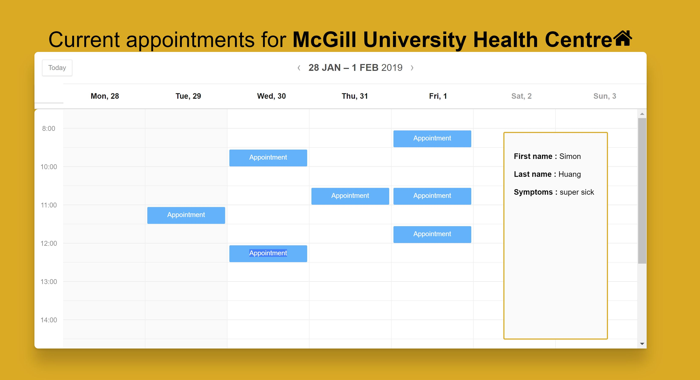
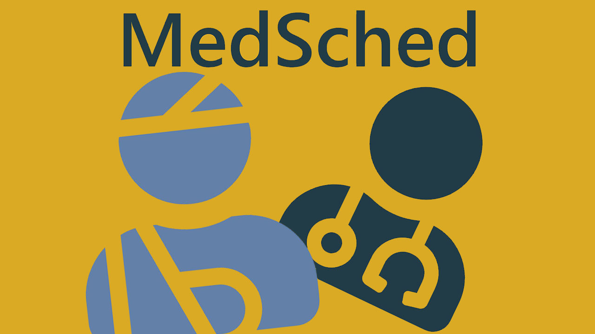

# MedSched
The application allows a user to select a clinic they wish to visit and create an appointment on the spot without the help of a middleman. They will be able to see all the available spots.

# Inspiration
We were inspired by the long waiting times at the doctor's offices. We were trying to figure out how to speed up the check-in process and give a better service for the patients. Moreover, the app will greatly reduce the number of waste generated with the paperwork.

# Possible Improvements
A check-in option for the patient and an automated queue for the healthcare professional would be a great future implementation. Furthermore, we have considered developing a mobile app since the majority of people own a smartphone.

# Screenshots

